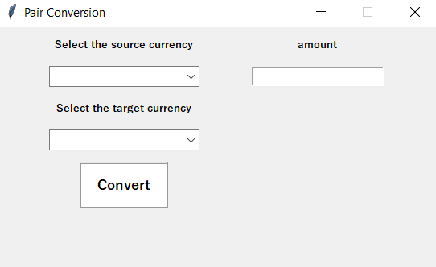

# Currency Converter & Live Chart

A desktop application for converting major world currencies and visualizing their exchange rate trends in real time. Built with Python and Tkinter, this tool offers a simple yet powerful interface for tracking global currency movements.

---

## Features

- Convert between popular currencies using live exchange rates
- Display real-time charts of currency trends using Matplotlib
- Built with a lightweight GUI using Tkinter
- No Python installation required — packaged with PyInstaller
- Available as a downloadable executable from GitHub Releases
- Source code accessible via GitHub for developers

---

## Technologies Used

| Component     | Technology               |
|---------------|--------------------------|
| GUI           | Tkinter                  |
| Data Handling | Pandas                   |
| API Requests  | Requests                 |
| Charting      | Matplotlib               |
| Packaging     | PyInstaller              |

---

## Screenshot





## Download

You can download the latest release from GitHub:

🔗 [Download Executable](RELEASE_LINK)

Or clone the repository to explore the source code:

```bash
git clone https://github.com/amirhosein-esm1999/ExchangeApp.git


